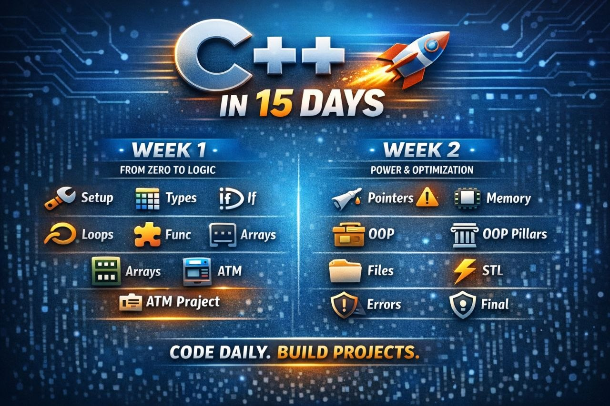

# 🚀 Master C++: The 15-Day Ultimate Roadmap



[](https://isocpp.org/)
[](https://github.com/)
[](https://opensource.org/licenses/MIT)
[](https://t.me/codding_tips)

Welcome to your accelerated journey into **Modern C++**. This repository is a structured, day-by-day guide designed to take you from a curious beginner to a confident C++ developer.

---

## 🗺️ Roadmap Architecture

### 🛡️ Phase 1: The Foundation (Week 1)
*Building the mental models and syntax mastery.*

| Day | Focus | Description | Status |
| :--- | :--- | :--- | :---: |
| **01** | **Setup & Output** | Environment configuration `std::cout` & `Hello World` | ✅ |
| **02** | **Data Systems** | Primitive types, memory sizes, and variable scopes | ✅ |
| **03** | **Control Flow** | Logical branching with `if/else` and `switch` | ✅ |
| **04** | **Iterations** | Loop structures (`for`, `while`) + Prime Challenge | ✅ |
| **05** | **Modularity** | Function definitions, prototypes, and parameters | ✅ |
| **06** | **Collections** | Static arrays and string manipulation | ✅ |
| **07** | **Capstone I** | 💳 **ATM System Project** (Structural Logic) | 🏆 |

### 🧠 Phase 2: Memory & Mastery (Week 2)
*Deep diving into low-level power and system design.*

| Day | Focus | Description | Status |
| :--- | :--- | :--- | :---: |
| **08** | **Pointers** | Memory addresses and the `*` & `&` magic ⚠️ | 🔥 |
| **09** | **Dynamic Allocation** | Heap vs Stack memory management | 🔥 |
| **10** | **OOP: Intro** | Classes, Objects, and Access Modifiers | 🏗️ |
| **11** | **OOP: Pillars** | Inheritance, Polymorphism, and Encapsulation | 🏗️ |
| **12** | **Persistence** | File I/O: Reading and writing to external files | 📂 |
| **13** | **Power Tools** | The Standard Template Library (STL) basics | ⚡ |
| **14** | **Safeguards** | Robust error handling with Exceptions | 🛡️ |
| **15** | **Capstone II** | 💊 **Pharmacy Management System** (Full Implementation) | 🚀 |

---

## 🏗️ Featured Projects

### 💳 ATM System (Day 7)
A comprehensive terminal-based banking application focusing on state management, user authentication, and transaction logic.

### 💊 Pharmacy Management (Day 15)
The final milestone. A full-scale application utilizing:
- **Object-Oriented Design** for product inventory.
- **File Handling** for permanent data storage.
- **STL Containers** for efficient data management.
- **Exception Handling** for a crash-proof user experience.

---

## 🛠️ How to Use This Repo

1. **Clone the project**:
   ```bash
   git clone https://github.com/yourusername/cpp-roadmap.git
   ```
2. **Navigate to a day**:
   ```bash
   cd day1
   ```
3. **Compile and Run**:
   ```bash
   g++ main.cpp -o app
   ./app
   ```

---

## 🤝 Community & Support

Stay updated with daily coding tips, challenges, and C++ insights.

[](https://t.me/codding_tips)

---

<p align="center">
  <i>"Practice daily = Real skill. The code remembers what you type."</i><br>
  <b>Happy Coding! 🚀</b>
</p>
